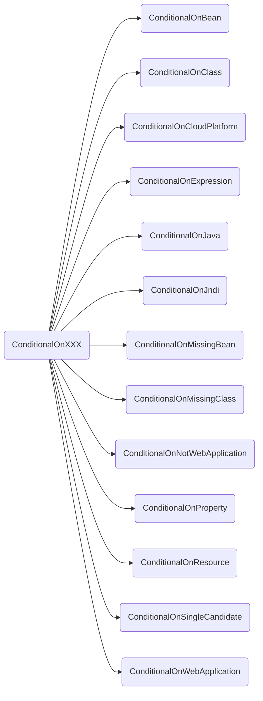
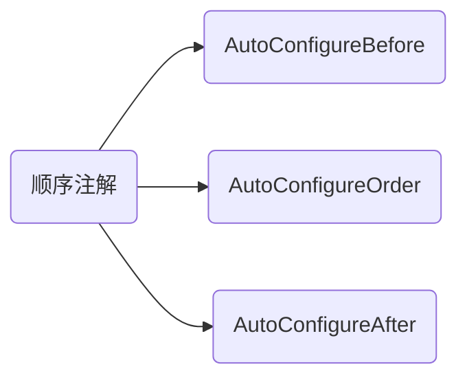

### 1. SpringBoot中的ConditionalOnXXX类型的注解




通过上面的可以看出来主要是有这些条件化加载类的注解。然后加上三个顺序的注解




通过这些注解来实现SpringBoot的自动注入和取消xml的配置。下面会选取 ***`ConditionalOnClass`*** 来进行源码分析。这些注解如何进行协同工作来实现条件化注入的。

### 2. SpringBoot源码分析之ConditionalOnClass

首先看一下源码：

```java
@Target({ ElementType.TYPE, ElementType.METHOD })
@Retention(RetentionPolicy.RUNTIME)
@Documented
@Conditional(OnClassCondition.class)
public @interface ConditionalOnClass {
    
	Class<?>[] value() default {};

	String[] name() default {};

}
```

通过上面可以看出来主要是通过 **`Spring`** 的 **`@Conditional`** 来实现。看一下 **`OnClassCondition`** 的源码：

```java
@Order(Ordered.HIGHEST_PRECEDENCE)
class OnClassCondition extends FilteringSpringBootCondition {
    //省了代码
}
```

可以看出来继承了 **`FilteringSpringBootCondition`** 类。

```java
abstract class FilteringSpringBootCondition extends SpringBootCondition
		implements AutoConfigurationImportFilter, BeanFactoryAware, BeanClassLoaderAware {
    //省略代码
}

public abstract class SpringBootCondition implements Condition {
    //省略代码
}
```

通过继承关系可以看出来，**`SpringBootCondition`** 实现了 **`Condition`** 这个顶层的接口，这个也是最终执行的接口。然后通过封装 **`FilteringSpringBootCondition`** 最后由不同的的具体实现类来实现。

```java
@Order(Ordered.HIGHEST_PRECEDENCE)
class OnClassCondition extends FilteringSpringBootCondition {

	@Override
	protected final ConditionOutcome[] getOutcomes(String[] autoConfigurationClasses,
			AutoConfigurationMetadata autoConfigurationMetadata) {
		// Split the work and perform half in a background thread if more than one
		// processor is available. Using a single additional thread seems to offer the
		// best performance. More threads make things worse.
		if (Runtime.getRuntime().availableProcessors() > 1) {
			return resolveOutcomesThreaded(autoConfigurationClasses, autoConfigurationMetadata);
		}
		else {
			OutcomesResolver outcomesResolver = new StandardOutcomesResolver(autoConfigurationClasses, 0,
					autoConfigurationClasses.length, autoConfigurationMetadata, getBeanClassLoader());
			return outcomesResolver.resolveOutcomes();
		}
	}

	private ConditionOutcome[] resolveOutcomesThreaded(String[] autoConfigurationClasses,
			AutoConfigurationMetadata autoConfigurationMetadata) {
		int split = autoConfigurationClasses.length / 2;
		OutcomesResolver firstHalfResolver = createOutcomesResolver(autoConfigurationClasses, 0, split,
				autoConfigurationMetadata);
		OutcomesResolver secondHalfResolver = new StandardOutcomesResolver(autoConfigurationClasses, split,
				autoConfigurationClasses.length, autoConfigurationMetadata, getBeanClassLoader());
		ConditionOutcome[] secondHalf = secondHalfResolver.resolveOutcomes();
		ConditionOutcome[] firstHalf = firstHalfResolver.resolveOutcomes();
		ConditionOutcome[] outcomes = new ConditionOutcome[autoConfigurationClasses.length];
		System.arraycopy(firstHalf, 0, outcomes, 0, firstHalf.length);
		System.arraycopy(secondHalf, 0, outcomes, split, secondHalf.length);
		return outcomes;
	}

	private OutcomesResolver createOutcomesResolver(String[] autoConfigurationClasses, int start, int end,
			AutoConfigurationMetadata autoConfigurationMetadata) {
		OutcomesResolver outcomesResolver = new StandardOutcomesResolver(autoConfigurationClasses, start, end,
				autoConfigurationMetadata, getBeanClassLoader());
		try {
			return new ThreadedOutcomesResolver(outcomesResolver);
		}
		catch (AccessControlException ex) {
			return outcomesResolver;
		}
	}

	@Override
	public ConditionOutcome getMatchOutcome(ConditionContext context, AnnotatedTypeMetadata metadata) {
		ClassLoader classLoader = context.getClassLoader();
		ConditionMessage matchMessage = ConditionMessage.empty();
		List<String> onClasses = getCandidates(metadata, ConditionalOnClass.class);
		if (onClasses != null) {
			List<String> missing = filter(onClasses, ClassNameFilter.MISSING, classLoader);
			if (!missing.isEmpty()) {
				return ConditionOutcome.noMatch(ConditionMessage.forCondition(ConditionalOnClass.class)
						.didNotFind("required class", "required classes").items(Style.QUOTE, missing));
			}
			matchMessage = matchMessage.andCondition(ConditionalOnClass.class)
					.found("required class", "required classes")
					.items(Style.QUOTE, filter(onClasses, ClassNameFilter.PRESENT, classLoader));
		}
		List<String> onMissingClasses = getCandidates(metadata, ConditionalOnMissingClass.class);
		if (onMissingClasses != null) {
			List<String> present = filter(onMissingClasses, ClassNameFilter.PRESENT, classLoader);
			if (!present.isEmpty()) {
				return ConditionOutcome.noMatch(ConditionMessage.forCondition(ConditionalOnMissingClass.class)
						.found("unwanted class", "unwanted classes").items(Style.QUOTE, present));
			}
			matchMessage = matchMessage.andCondition(ConditionalOnMissingClass.class)
					.didNotFind("unwanted class", "unwanted classes")
					.items(Style.QUOTE, filter(onMissingClasses, ClassNameFilter.MISSING, classLoader));
		}
		return ConditionOutcome.match(matchMessage);
	}

	private List<String> getCandidates(AnnotatedTypeMetadata metadata, Class<?> annotationType) {
		MultiValueMap<String, Object> attributes = metadata.getAllAnnotationAttributes(annotationType.getName(), true);
		if (attributes == null) {
			return null;
		}
		List<String> candidates = new ArrayList<>();
		addAll(candidates, attributes.get("value"));
		addAll(candidates, attributes.get("name"));
		return candidates;
	}

	private void addAll(List<String> list, List<Object> itemsToAdd) {
		if (itemsToAdd != null) {
			for (Object item : itemsToAdd) {
				Collections.addAll(list, (String[]) item);
			}
		}
	}

	private interface OutcomesResolver {

		ConditionOutcome[] resolveOutcomes();

	}

	private static final class ThreadedOutcomesResolver implements OutcomesResolver {

		private final Thread thread;

		private volatile ConditionOutcome[] outcomes;

		private ThreadedOutcomesResolver(OutcomesResolver outcomesResolver) {
			this.thread = new Thread(() -> this.outcomes = outcomesResolver.resolveOutcomes());
			this.thread.start();
		}

		@Override
		public ConditionOutcome[] resolveOutcomes() {
			try {
				this.thread.join();
			}
			catch (InterruptedException ex) {
				Thread.currentThread().interrupt();
			}
			return this.outcomes;
		}

	}

	private final class StandardOutcomesResolver implements OutcomesResolver {

		private final String[] autoConfigurationClasses;

		private final int start;

		private final int end;

		private final AutoConfigurationMetadata autoConfigurationMetadata;

		private final ClassLoader beanClassLoader;

		private StandardOutcomesResolver(String[] autoConfigurationClasses, int start, int end,
				AutoConfigurationMetadata autoConfigurationMetadata, ClassLoader beanClassLoader) {
			this.autoConfigurationClasses = autoConfigurationClasses;
			this.start = start;
			this.end = end;
			this.autoConfigurationMetadata = autoConfigurationMetadata;
			this.beanClassLoader = beanClassLoader;
		}

		@Override
		public ConditionOutcome[] resolveOutcomes() {
			return getOutcomes(this.autoConfigurationClasses, this.start, this.end, this.autoConfigurationMetadata);
		}

		private ConditionOutcome[] getOutcomes(String[] autoConfigurationClasses, int start, int end,
				AutoConfigurationMetadata autoConfigurationMetadata) {
			ConditionOutcome[] outcomes = new ConditionOutcome[end - start];
			for (int i = start; i < end; i++) {
				String autoConfigurationClass = autoConfigurationClasses[i];
				if (autoConfigurationClass != null) {
					String candidates = autoConfigurationMetadata.get(autoConfigurationClass, "ConditionalOnClass");
					if (candidates != null) {
						outcomes[i - start] = getOutcome(candidates);
					}
				}
			}
			return outcomes;
		}

		private ConditionOutcome getOutcome(String candidates) {
			try {
				if (!candidates.contains(",")) {
					return getOutcome(candidates, this.beanClassLoader);
				}
				for (String candidate : StringUtils.commaDelimitedListToStringArray(candidates)) {
					ConditionOutcome outcome = getOutcome(candidate, this.beanClassLoader);
					if (outcome != null) {
						return outcome;
					}
				}
			}
			catch (Exception ex) {
				// We'll get another chance later
			}
			return null;
		}

		private ConditionOutcome getOutcome(String className, ClassLoader classLoader) {
			if (ClassNameFilter.MISSING.matches(className, classLoader)) {
				return ConditionOutcome.noMatch(ConditionMessage.forCondition(ConditionalOnClass.class)
						.didNotFind("required class").items(Style.QUOTE, className));
			}
			return null;
		}

	}

}
```

