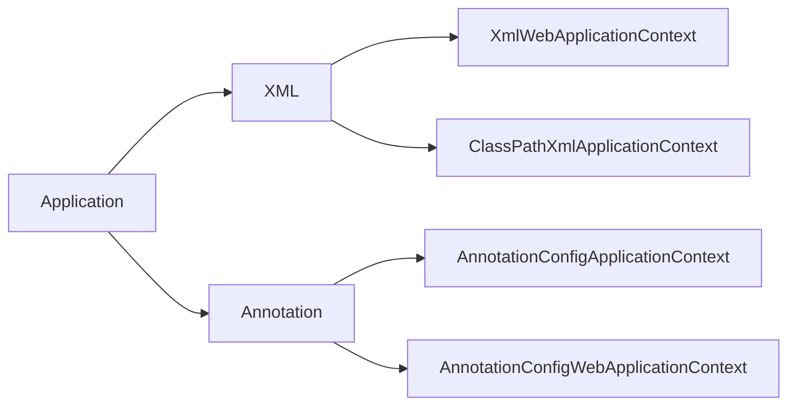

### 1. ApplicationContext源码解析

在Spring框架的使用过程中见得最多的一个类就是 **`ApplicationContext`** 这个类贯穿了整个Spring的开发。下面来看一下该类的一些定义：

```java
public interface ApplicationContext extends EnvironmentCapable, ListableBeanFactory, HierarchicalBeanFactory,
		MessageSource, ApplicationEventPublisher, ResourcePatternResolver {
	@Nullable
	String getId();

	String getApplicationName();

	String getDisplayName();

	long getStartupDate();

	@Nullable
	ApplicationContext getParent();

	AutowireCapableBeanFactory getAutowireCapableBeanFactory() throws IllegalStateException;
}
```

从定义可以看出来，继承了 **`EnvironmentCapable`** , **`ListableBeanFactory`** , **`HierarchicalBeanFactory`** , 
		**`MessageSource`** , **`ApplicationEventPublisher`** , **`ResourcePatternResolver`** 继承都是一些基础的接口。

-  **BeanDefinitionRegistry**  

  这个接口主要用来注册Bean的定义到Spring容器的上下文中，把Java类抽象为 ***`BeanDefinition`*** 

-  **SingletonBeanRegistry** 

  Bean的单例模式注册
  
-   **BeanFactory**  

   主要用来获取Bean， BeanFactory实现了这BeanDefinitionRegistry和SingletonBeanRegistry两个，把Bean的定义和Bean的管理结合起来。 

-   **Environment** 

   获取环境变量，和环境配置相关的

-   **MessageSource** 

   spring的国际化处理

-   **ApplicationEventPublisher**

   Spring时间发布，和事件相关的接口 

-   **ResourcePatternResolver**

   资源的处理 

对于 **`ApplicationContext`** 的实现主要在 **Java** 的开发项目中有四个：

- ClassPathXmlApplicationContext
- AnnotationConfigApplicationContext
- XmlWebApplicationContext
- AnnotationConfigWebApplicationContext




> 上面的四个实现大体能够分成两大类：
>
> - 对以前传统的XML配置的支持从xml读取配置
> - 对注解的支持，主要通过注解来实现xml中的配置功能

下面看一下Application的继承关系：


